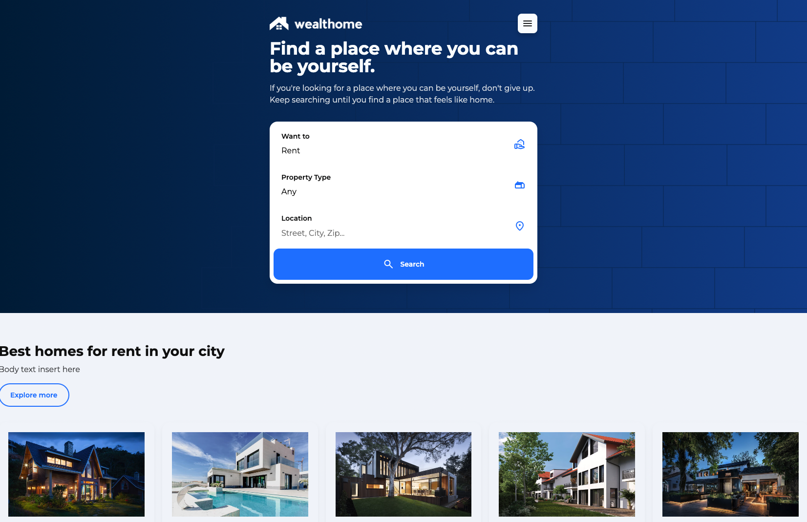

# Turtle Synergy LLC Website

## Overview
Welcome to the repository for the Turtle Synergy LLC website. This site is designed to showcase our home rental services across Southern California and Las Vegas.

## Features
- **Responsive Design**: Ensures a seamless experience across various devices.
- **Interactive Map**: For easy location selection and property viewing.
- **Property Listings**: Detailed view of available properties for rent, sell, or buy.
- **User-Friendly Navigation**: Easy to navigate through different sections.

## Technologies Used
- HTML5
- CSS3 (with a focus on modern design principles)
- JavaScript (for interactive features)

## Setup and Installation
1. Clone the repository to your local machine.
2. Open the HTML file in a web browser to view the website.

## Contributing
We welcome contributions to our project. If you have suggestions or improvements, please fork the repository and submit a pull request.

## License
This project is licensed under the [MIT License](LICENSE).

## Contact Information
For any further inquiries, please contact us at turtlesynergyllc@gmail.com or visit our [Contact Us](#) page on the website.

## Acknowledgments
Special thanks to the team and contributors who have been part of this project.

---

© 2023 Turtle Synergy LLC. All Rights Reserved.
